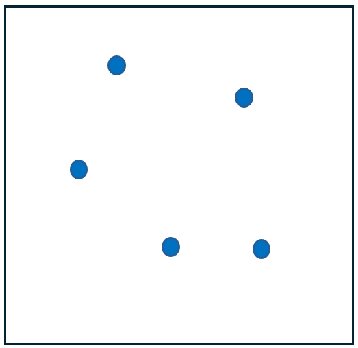
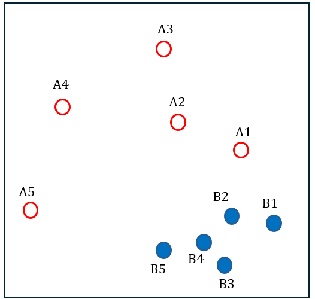
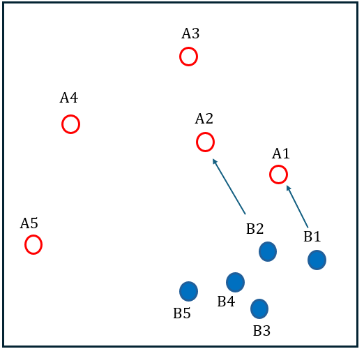
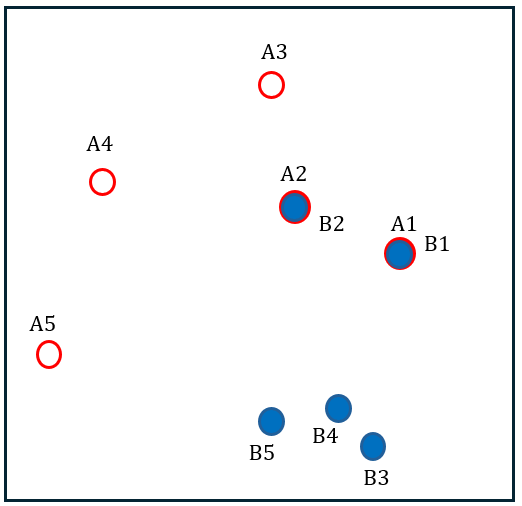
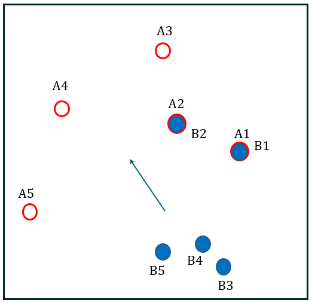
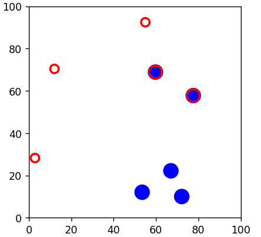
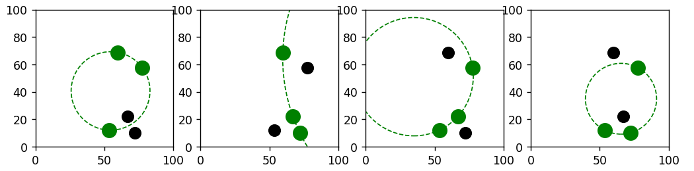

# Circle Experiment

## Overview

The circle experiment involves exploring the geometric relationships between points on a plane. Specifically, it investigates the formation of circles under certain conditions with a set of random points.

### Experiment Description

1. **Setup**: Place 5 random points on a plane (e.g., on a piece of paper).  
     


2. **Condition**: Select three points from the 5 to draw a circle. The circle must satisfy the following conditions:  
    
   - Exactly one of the remaining points lies **inside** the circle.  
   - Exactly one of the remaining points lies **outside** the circle.  


3. **Observation**: For any such selection of three points, there are always **exactly four circles** that meet the condition.

---

## Proof

The proof can be outlined as follows:

### Given:
- Two sets of random points `A` and `B` in a 2D plane, each containing 5 points.  
- The points in `A` are fixed.

    

### Steps:
1. Align `B1` and `B2` with `A1` and `A2`, respectively.



2. Map the remaining points in `B` (`B3`, `B4`, `B5`) to the remaining points in `A` (`A3`, `A4`, `A5`).


### Observation:
At every moment of this mapping, the number of circles satisfying the condition should remain exactly four. If so, Q.E.D.

---

## Current Status

The experiment is visualized in the script `demo.py`.

### Running the Code

To visualize the experiment, run the following command in your terminal:  
```bash
python3 demo.py
```

